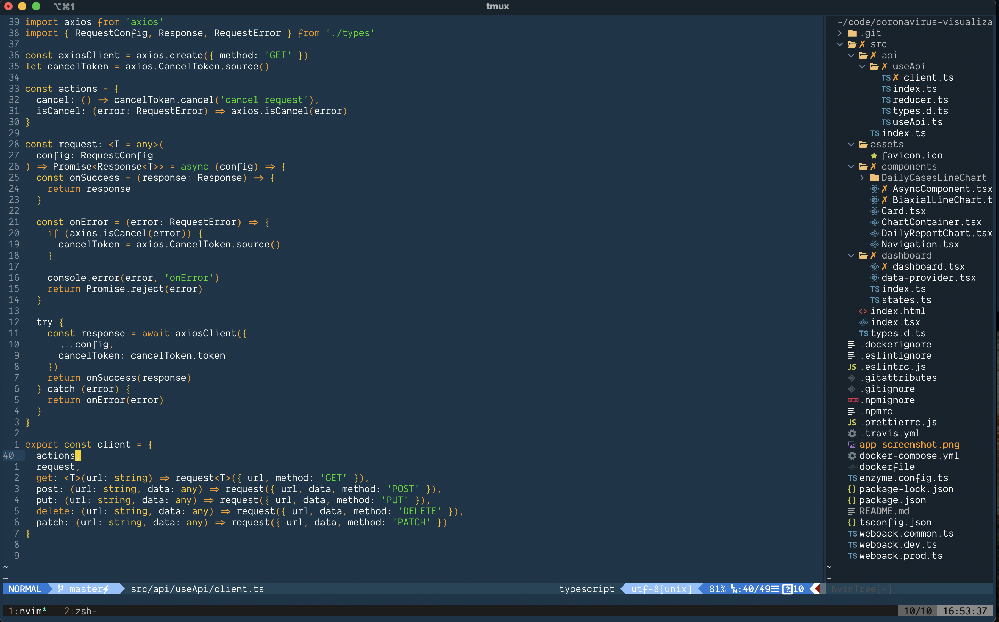

# Configuration

> All the files needed to setup a new machine and synchonize change to dotfiles across devices.

### Setup new machine

- Run `.macos.sh` to setup development environment and apply system configurations
- Run `install.sh` to create symlinks to my dotfiles using [Stow](https://www.kabisa.nl/tech/how-to-manage-dotfiles-with-gnu-stow)

### Synchronize dotfiles

- All dotfiles are located here, `${HOME}/configuration`
- Push changes, and pull from other devices

### Setup Dotfiles only

> files for Neovim, Tmux, Zsh, and VSCode

```
brew install neovim tmux stow

git clone git@github.com:nathanielhall/configuration.git "${HOME}/configuration"

git clone https://github.com/zsh-users/zsh-autosuggestions ~/.zsh/zsh-autosuggestions

npm i -g typescript typescript-language-server
npm install -g eslint_d
brew install efm-langserver
```

- Remove any existing files since these will become symlinks (e.g., .zshrc, .zprofile, .tmux.config)
- Run `./install.sh` to stow folders defined in `$STOW_FOLDERS`

### Example:



### Resources on managing dotfiles using stow

[DONT DO THAT WITH YOUR DOTFILES (DO THIS)](https://youtu.be/tkUllCAGs3c)
[How to manage dotfiles with GNU Stow](https://www.kabisa.nl/tech/how-to-manage-dotfiles-with-gnu-stow/)

### Zsh Configuration Info

- zsh-autosuggestions
- vi-mode
  - change cursor shape by mode [Luke Smith Zshrc](https://gist.github.com/LukeSmithxyz/e62f26e55ea8b0ed41a65912fbebbe52)
