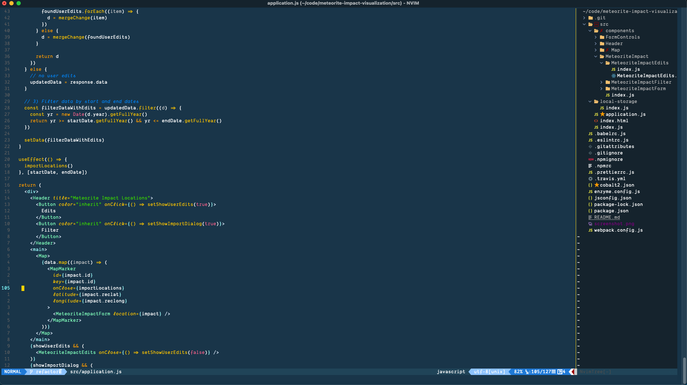
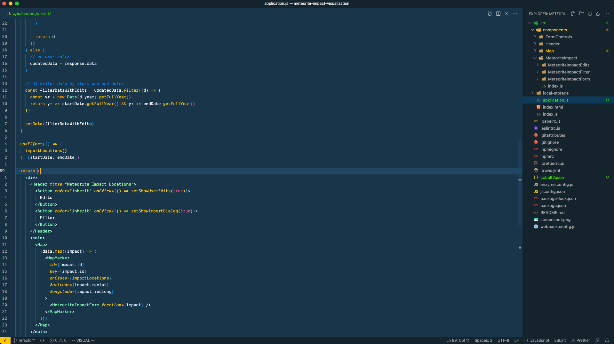

# Configuration

> My personal configuration files used to setup a new machine and synchonize dotfiles across devices.

### Setup new machine

- `.macos.sh` to install apps, setup dev environment, and apply system configurations
- `install.sh` to create symlinks to my dotfiles using [Stow](https://www.kabisa.nl/tech/how-to-manage-dotfiles-with-gnu-stow)

### Synchronize dotfiles

- All dotfiles are located here, `${HOME}/configuration`
- Push changes, and pull from other devices

### Setup Dotfiles only

> files for Neovim, Tmux, Zsh, and VSCode

```
brew install neovim tmux stow

git clone git@github.com:nathanielhall/configuration.git "${HOME}/configuration"

git clone https://github.com/zsh-users/zsh-autosuggestions ~/.zsh/zsh-autosuggestions

npm i -g typescript typescript-language-server
npm install -g eslint_d
brew install efm-langserver
```

- Backup any existing configuration files (e.g., .zshrc, .zprofile, .tmux.config)
- Run `./install.sh` to stow folders defined in `$STOW_FOLDERS`

### Cobalt2 Theme

> Working toward a common Cobalt2 theme between vscode, neovim, and iTerm.

#### Neovim



#### VSCode



### Enabling italics in Terminal
- [Enabling italics in Vim and tmux](https://rsapkf.xyz/weblog/enabling-italics-vim-tmux)

### Zsh Setup

- zsh-autosuggestions
- vi-mode
- change cursor shape by mode [Luke Smith Zshrc](https://gist.github.com/LukeSmithxyz/e62f26e55ea8b0ed41a65912fbebbe52)

### iTerm Setup

- Dank Mono Font patched using font patcher with Docker: [Nerd Fonts: Option 8 - Patch your own font](https://github.com/ryanoasis/nerd-fonts#option-8-patch-your-own-font)
  - $ `docker run -v ~/nerd-fonts/in:/in -v ~/nerd-fonts/out:/out nerdfonts/patcher --fontawesome --octicons`
  - Font 14 (vertical spacing: 120)
- [Cobalt Theme by Wes Bos](https://github.com/wesbos/Cobalt2-iterm)
  - In iTerm2 access the Preferences pane on the Profiles tab. Under the Colors tab import the cobalt2.itermcolors file via the Load Presets drop-down.
